# Solution Architecture

## Overview

**Tech Support AI** is a **React** web chat UI, an **Admin SPA** for Agent Handbook maintenance, and a **FastAPI** backend. The API owns session persistence, attachment staging, graph invocation, and KB admin routes. Each user message runs through a **LangGraph** workflow (`packages/agents`) that calls an **LLMGateway** for conversation, a **troubleshoot** node when `KB_RAG_ENABLED=true` (Qdrant retrieval via `packages/knowledge`), and a **TicketGateway** for help desk operations. **PostgreSQL** is the durable store; **Redis** caches session context and recent turns; **MinIO/S3** holds attachment bytes; **Qdrant** holds handbook vectors; handbook source files use **Ceph RGW** (or S3-compatible / in-memory for local dev).

## Runtime modes

Two independent flags control behaviour. They are often confused in diagrams — both matter.

| `GRAPH_ENABLED` | `GRAPH_LLM_MODE` | What runs on `POST .../messages` |
| --------------- | ---------------- | -------------------------------- |
| `false` | *(any)* | **`MockSupportGraph`** in `apps/api` — rule-based stub, **no LangGraph**, **no Zammad** |
| `true` | `mock` | **LangGraph** + **`MockConversationLLM`** — full orchestration and ticket_tool **can** call Zammad |
| `true` | not `mock` | **LangGraph** + live **LLMGateway** (`LLM_PROVIDER`: OpenAI, Azure OpenAI, or Anthropic) |

`GRAPH_LLM_MODE=mock` only applies when `GRAPH_ENABLED=true`. It selects the agents-package mock LLM, not the API-layer `MockSupportGraph`.

Optional: `GRAPH_CHECKPOINT=true` persists LangGraph thread state to PostgreSQL via `langgraph-checkpoint-postgres` (off by default).

## Logical architecture (as implemented)

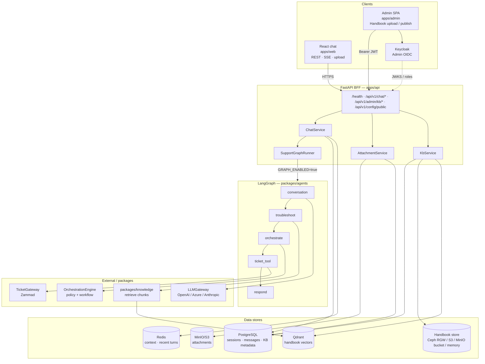

**What the diagram shows:**

- **ChatService** (not LangGraph) reads/writes PostgreSQL and Redis, stages attachments, then invokes the graph.
- **KbService** + Admin routes manage handbook ingest/publish; chat retrieval only uses **published** documents in Qdrant.
- **Orchestration** is a **LangGraph node** (`orchestrate_node`), not a separate service the API calls directly.
- **LLMGateway** and **TicketGateway** are built inside graph nodes (`get_conversation_llm()`, `build_ticket_gateway()`), not singleton microservices.
- **Object storage:** attachments via `AttachmentService` (`S3_*`); handbooks via `CEPH_RGW_*` / `KB_HANDBOOK_*` (Compose may point both at MinIO with **different buckets**).
- **Troubleshoot** is classic RAG: deterministic retrieval + grounded LLM guidance with citation validation.

## Design principles

1. **LLM for language only** — Conversation, clarification, structured intent proposals, and screenshot text extraction. Not business policy.
2. **Orchestration gates every help desk call** — `PolicyValidator` + `WorkflowEngine` in the `orchestrate` node before `ticket_tool` runs.
3. **Provider-grounded ticket IDs** — Ticket numbers in the UI come only from Zammad API responses.
4. **Pluggable LLM** — `LLMGateway` protocol; OpenAI (default), Azure OpenAI, Anthropic; mock when `GRAPH_LLM_MODE=mock`.
5. **Pluggable ticketing** — `TicketGateway` protocol; Zammad live, ServiceNow stub.
6. **API owns persistence** — Graph nodes are stateless per turn; messages and sessions are saved by `ChatService` after the graph completes.
7. **Attachments staged before the graph** — Upload → object storage → link on user message → `pending_attachments` in graph state.
8. **No MCP** — Direct REST/SDK integration.
9. **Troubleshoot uses classic RAG** — Handbook retrieval uses Python + Qdrant; the configured LLM synthesizes adaptive grounded steps with validated source citations. Chat never reveals handbook titles; ticket enrichment may name the handbook for agents.

## End-to-end flow: send message

This is the actual path implemented in `ChatService.send_message` / `send_message_stream`. Attachment upload (`POST .../attachments`) is a separate step before the message is sent — files are already in MinIO when the message arrives.

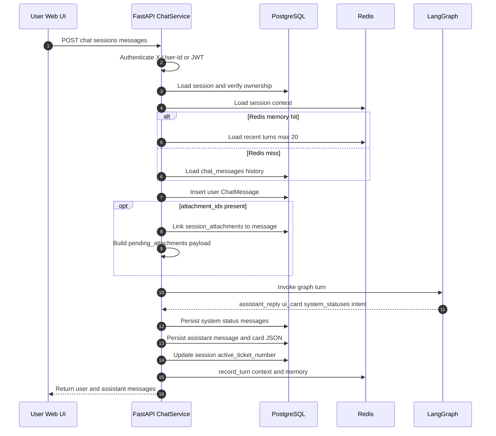

## LangGraph flow (GRAPH_ENABLED=true)

Compiled graph: `packages/agents/graph.py` → `SupportGraphRunner` in `packages/agents/runner.py`.

### Topology

Routing overview (control flow):

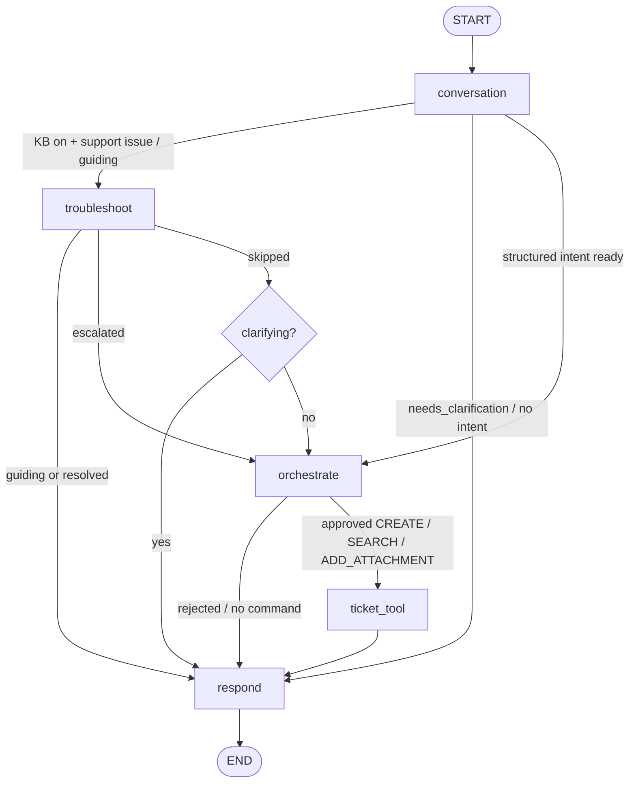

Typical **single-turn** execution through graph nodes:

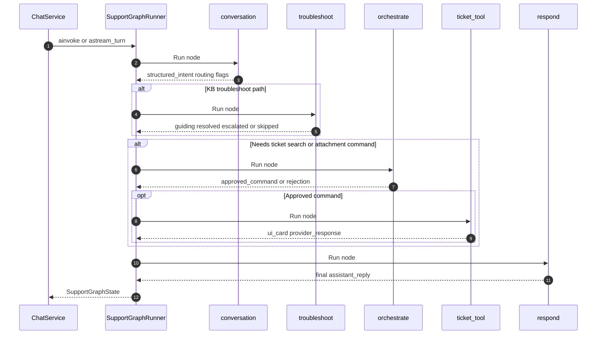

`KB_RAG_ENABLED=false` skips the troubleshoot branch entirely (legacy CreateTicket path).

### Node responsibilities (actual code)

| Node | Module | What it does |
| ---- | ------ | ------------ |
| `conversation` | `nodes/conversation.py` | Adds user message to state; **short-circuits LLM** when `pending_attachments` + `active_ticket_number` → builds `AddAttachment` intent directly; else calls `LLMGateway.propose_intent()`; sets `structured_intent`, `is_support_issue`, `problem_summary`, and optional clarify `assistant_reply` |
| `troubleshoot` | `nodes/troubleshoot.py` | Retrieves handbook chunks via `packages/knowledge`; calls `LLMGateway.generate_troubleshoot_guidance` for adaptive grounded steps (citation-validated; empathetic copy, no handbook name); on fail/escalate synthesizes/enriches `CreateTicket`; on resolve deflects (no ticket) |
| `orchestrate` | `nodes/orchestrate.py` | `OrchestrationEngine.process()` — policy validation + workflow mapping → `approved_command` or rejection message |
| `ticket_tool` | `nodes/ticket_tool.py` | `build_ticket_gateway().execute(TicketCommand)` — create ticket, search, or add attachment; sets `ui_card`, `active_ticket_number`, `provider_response` |
| `respond` | `nodes/respond.py` | Formats final `assistant_reply` (prefers ticket-created confirmation over stale clarify text) |

### Routing rules

| From | Condition | To |
| ---- | --------- | -- |
| `conversation` | `kb_rag_enabled` and (`troubleshoot` guiding, or support issue / CreateTicket) and **no** `active_ticket_number` and status not skipped/resolved/escalated | `troubleshoot` |
| `conversation` | `needs_clarification` or no `structured_intent` (and not routing to troubleshoot) | `respond` |
| `conversation` | `structured_intent` present | `orchestrate` |
| `troubleshoot` | status `guiding` or `resolved` | `respond` |
| `troubleshoot` | status `escalated` | `orchestrate` |
| `troubleshoot` | status `skipped` | `respond` if clarifying; else `orchestrate` |
| `orchestrate` | not `APPROVED` or no command | `respond` |
| `orchestrate` | approved `CREATE_TICKET`, `SEARCH_TICKETS`, or `ADD_ATTACHMENT` | `ticket_tool` |
| `ticket_tool` | always | `respond` |

Sessions with an **active ticket** skip L1 troubleshoot (attachment / status flows continue normally).

### Graph state (`SupportGraphState`)

Key fields: `user_input`, `messages`, `pending_attachments`, `structured_intent`, `orchestration_result`, `approved_command`, `system_statuses`, `ui_card`, `active_ticket_number`, `assistant_reply`, `needs_clarification`, `kb_rag_enabled`, `is_support_issue`, `problem_summary`, `troubleshoot`, `troubleshoot_deflection`.

## Request flow: L1 troubleshoot then ticket (KB on)

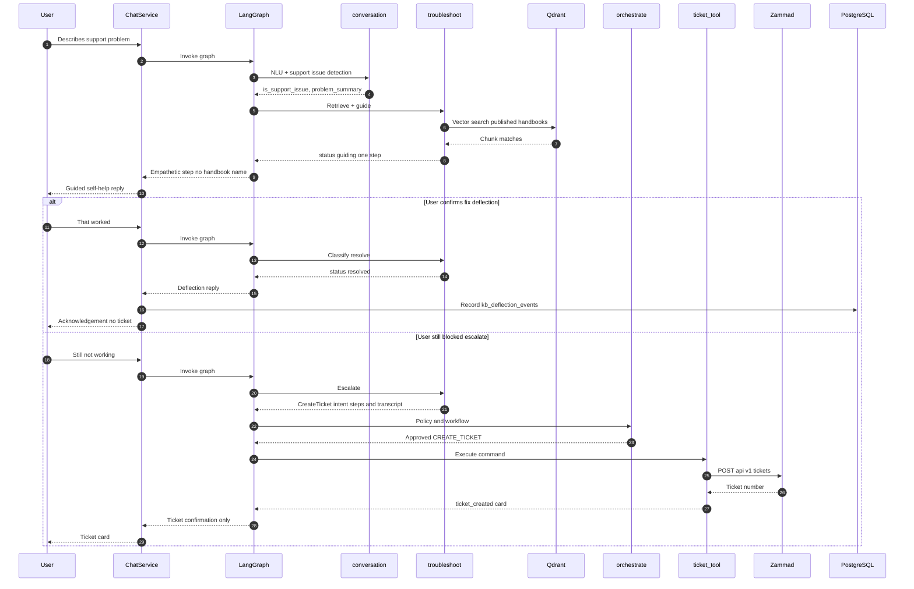

## Request flow: create ticket (happy path, KB off or no match)

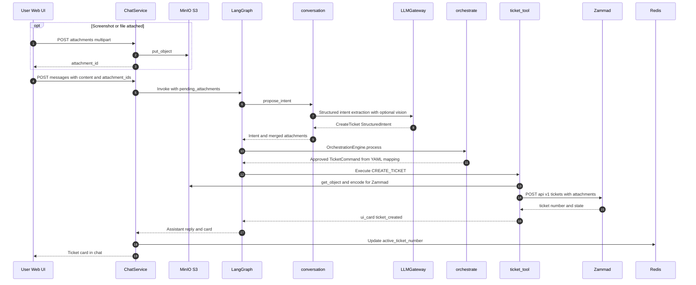

If orchestration rejects, `ticket_tool` is never reached — the graph routes to `respond` with a clarification or rejection message.

## Request flow: add attachment to active ticket

Two paths exist in code:

**A — LLM bypass:** session already has `active_ticket_number` and user sends new files.

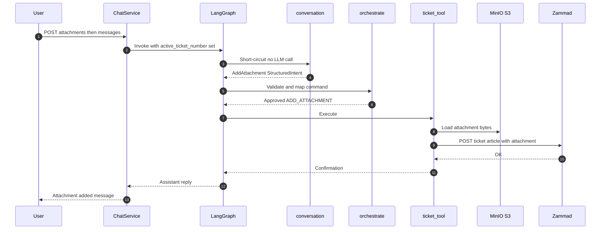

**B — New ticket with attachments:** `CreateTicket` intent includes `attachments` in the payload; Zammad receives them on the initial article (see create-ticket flow above).

## LLM provider abstraction

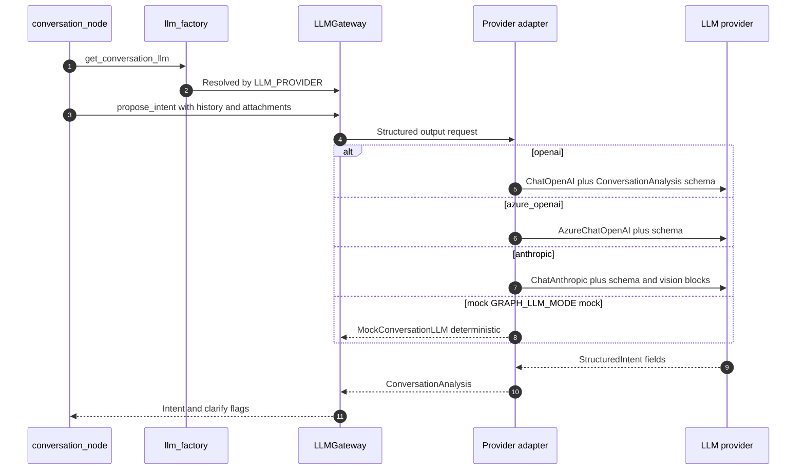

| Module | Role |
| ------ | ---- |
| `llm_gateway.py` | `LLMGateway` protocol |
| `llm_settings.py` | `LLMSettings`, `configure_llm()`, `resolved_provider()` |
| `llm_factory.py` | `build_llm_gateway()` |
| `conversation_analysis.py` | Shared prompt, `ConversationAnalysis` schema, intent mapping |
| `providers/*.py` | Provider adapters |
| `attachment_content.py` | Vision blocks (OpenAI `image_url` vs Anthropic base64 `image`) |

| Variable | Effect |
| -------- | ------ |
| `GRAPH_LLM_MODE=mock` | `MockConversationLLM` — no external LLM API |
| `LLM_PROVIDER` | `openai` (default), `azure_openai`, `anthropic` when LLM mode is not `mock` |
| `LLM_TEMPERATURE` | Shared temperature (default `0.2`) |

Settings applied at API startup in `main.py` lifespan via `configure_llm()`.

## Ticketing provider abstraction

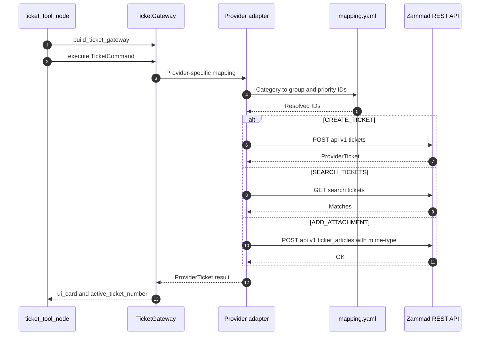

- `TICKETING_PROVIDER=zammad|servicenow`
- Mapping: `config/providers/{provider}/mapping.yaml`
- Attachments on Zammad articles require `mime-type` (hyphenated); `ZammadClient` uses `model_dump(by_alias=True)`

Orchestration (`packages/orchestration`) is **only** invoked from the `orchestrate` graph node — not from API routes directly (except `scripts/create_ticket.py` CLI).

## Component map

| Layer | Location | Responsibility |
| ----- | -------- | -------------- |
| Web UI | `apps/web` | ChatShell, Composer (📎), MessageStream (Markdown), cards |
| Admin UI | `apps/admin` | Handbook upload/publish/preview (Keycloak) |
| API | `apps/api` | REST/SSE, chat auth, **ChatService**, **AttachmentService**, **KbService**, admin KB routes, graph lifecycle |
| API mock (legacy) | `apps/api/services/mock_graph.py` | `MockSupportGraph` when `GRAPH_ENABLED=false` |
| Agents | `packages/agents` | LangGraph, **LLMGateway**, conversation / troubleshoot / ticket nodes |
| Knowledge | `packages/knowledge` | Ingest, chunking, embeddings, Qdrant/memory store, Docling, handbook storage |
| Orchestration | `packages/orchestration` | `OrchestrationEngine`, policy, workflow, YAML mapping |
| Ticketing | `packages/ticketing` | **TicketGateway**, Zammad/ServiceNow adapters, attachment encoding |
| Storage | `packages/storage` | MinIO/S3 for attachments; shared S3 helpers for handbook backend |
| Zammad client | `packages/zammad-client` | HTTP client, DTOs, retries |
| Shared | `packages/shared` | JSON schemas, reason codes |

## Data stores

### PostgreSQL (source of truth)

| Table | Written by | Purpose |
| ----- | ---------- | ------- |
| `chat_sessions` | ChatService | Session metadata, `active_ticket_number` |
| `chat_messages` | ChatService | User, assistant, system messages; optional `card` and `attachments` JSONB |
| `session_attachments` | AttachmentService | Staged uploads before/after message link |
| `kb_documents` | KbService | Handbook metadata (slug, status, object keys, chunk counts) |
| `kb_ingest_jobs` | KbService | Ingest/publish/reindex job status |
| `kb_deflection_events` | ChatService | Resolved / escalated outcomes after troubleshoot |
| `policy_audit_log` | *(schema only)* | Not wired to chat flow yet |
| `zammad_operations` | *(schema only)* | Used by CLI `create_ticket.py` + AuditService |
| `reason_code_messages` | Seed/migration | Rejection copy catalog |

### Redis (ephemeral acceleration)

| Key | Purpose |
| --- | ------- |
| `session:{id}:context` | `active_ticket_number`, `message_count`, `last_message_at`, `troubleshoot` progress |
| `session:{id}:memory` | Rolling recent turns (max 20) for graph history hydrate |

TTL defaults to 24h (`REDIS_SESSION_TTL_SECONDS`). Loss of Redis does not lose messages — PostgreSQL rebuilds history on next turn.

### Object storage

| Key pattern | Purpose |
| ----------- | ------- |
| `sessions/{session_id}/{attachment_id}/{filename}` | Attachment bytes |

## Attachment pipeline

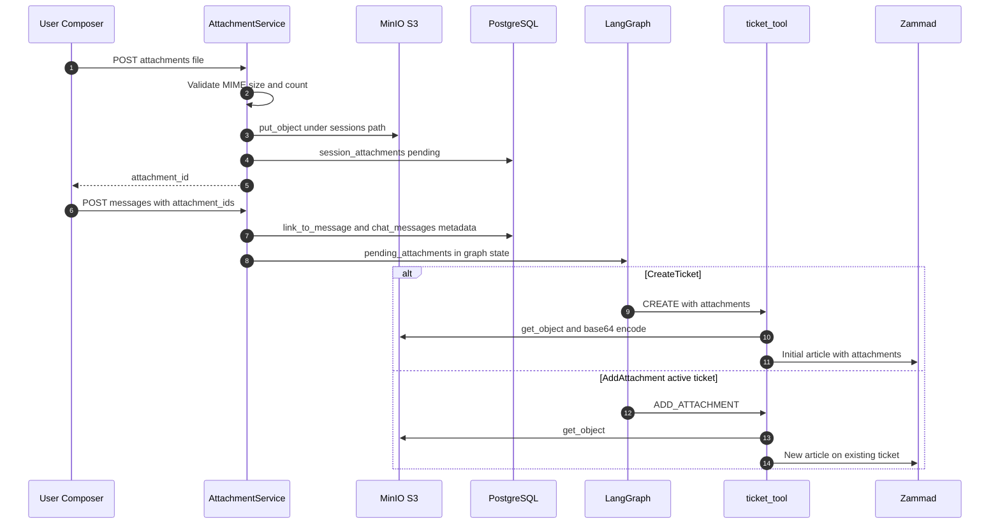

| Limit | Default |
| ----- | ------- |
| Max file size | 10 MB |
| Max per message | 5 files |
| Blocked | Executables |

## Admin KB handbook lifecycle

Handbook upload, ingest, and publish are separate from the chat message path. Only **published** documents are retrieved by the troubleshoot node.

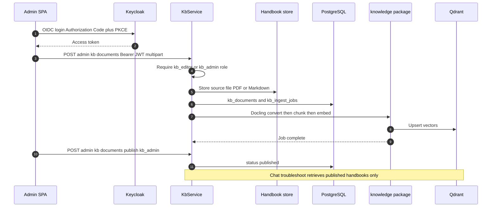

## Authentication

| Mode | Behaviour |
| ---- | --------- |
| `dev` | `X-User-Id` header |
| `jwt` | Bearer JWT, `sub` claim *(stub)* |
| OIDC | Planned |

Sessions are user-scoped; cross-user access returns 403.

## Streaming

| Feature | Implementation |
| ------- | -------------- |
| Thought streaming | `POST .../messages/stream` — `SupportGraphRunner.astream_turn` yields `system_statuses` as SSE events |
| Token streaming | Not implemented |

Gated by `THOUGHT_STREAMING_ENABLED`; UI reads `/api/v1/config/public`.

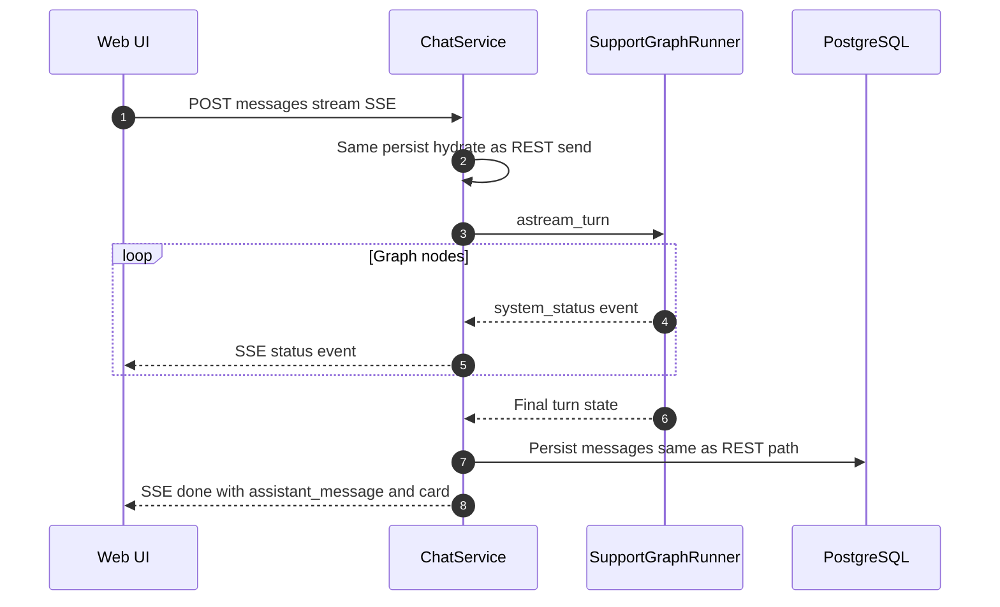

## Diagnostic endpoint

`POST /api/v1/chat/sessions/{id}/graph/invoke` — runs a graph turn **without persisting** messages (testing). Same `GRAPH_ENABLED` / mock branching as chat.

## Configuration artifacts

| File | Purpose |
| ---- | ------- |
| `config/providers/zammad/mapping.yaml` | Category → group/priority |
| `packages/shared/schemas/*.json` | Intent, command, card contracts |
| `.env` | Secrets and flags |

See [Environment Variables](appendices/B-environment-variables.md).

## Planned enhancements

- Confirm-before-submit interrupt flow
- UpdateTicket, Escalate, Cancel intents
- Policy/provider audit wired to chat message flow
- PDF text extraction for **attachment** context (handbook PDFs already convert via Docling)
- End-user OIDC / SSO for chat (admin Keycloak is available)
- LLM token streaming
- OpenTelemetry

See [Capability Matrix](appendices/C-capability-matrix.md).

## Related documents

- [Functional Specification Summary](02-functional-specification-summary.md)
- [Zammad Integration Guide](05-integration-guide-zammad.md)
- [Security & Data Handling](04-security-and-data-handling.md)
- [API Overview](07-api-overview.md)
